# 🍷 Professional Wine Quality Classifier

Predict wine quality — **Poor / Average / Good** — from physicochemical properties using an end-to-end ML pipeline (training → evaluation → deployment).

**Live app:** https://4okshqzpjpsapep79xtmbs.streamlit.app/  
**Dataset:** https://www.kaggle.com/datasets/rajyellow46/wine-quality

---

## 🧭 Project Layout 

```text

project_wine/
├─ images/ # All generated charts & figures (PNG)
│ ├─ alcohol_vs_volatile.png
│ ├─ confusion_matrix.png
│ ├─ correlation_heatmap.png
│ ├─ cv_results.png
│ ├─ feature_distribution-1.png
│ ├─ feature_distribution-2.png
│ ├─ feature_distribution-3.png
│ ├─ feature_distribution-4.png
│ ├─ feature_importance.png
│ ├─ kmeans_elbow.png
│ ├─ knn_validation_curve.png
│ └─ model vs weighted avg.png
├─ models/ # Trained artifacts used by the app
│ ├─ wine_model.pkl # Best model (Random Forest, balanced)
│ ├─ wine_scaler.pkl # StandardScaler
│ ├─ wine_label_encoder.pkl # Target encoder (Poor/Average/Good)
│ ├─ wine_feature_names.pkl # Exact feature order
│ ├─ wine_type_encoder.pkl # Red/White encoder
│ ├─ feature_ranges.pkl # Input validation ranges
│ ├─ dataset_stats.pkl # Training dataset summary
│ └─ model_performance.pkl # CV/Test metrics for dashboard
├─ model_test_script.py # Quick sanity check for artifacts
├─ wine_streamlit_app.py # Streamlit UI (loads from /models)
├─ Wine_data_processing_model_training_testing.py # Training pipeline
├─ winequalityN.csv # Kaggle dataset (6,497 rows)
├─ requirements.txt # Python dependencies
└─ Technical Report_Project_Wine.docx

```

## ⚡ Quick Start

```bash
# 1) Clone & enter
git clone https://github.com/dattaBus-anls/-Professional-Wine-Quality-Classifier-.git
cd project_wine

# 2) Install deps
pip install -r requirements.txt

# 3a) Re-train to regenerate artifacts
python Wine_data_processing_model_training_testing.py

# 3b) Or verify existing artifacts
python model_test_script.py

# 4) Run the app
streamlit run wine_streamlit_app.py

```

🎯 Highlights
Best Model: Random Forest (balanced class weights)

Test Accuracy: 82.2%

Cross-Validation: 81.8% ± 1.8% (Stratified 5-fold)

KNN Tuning: Optimal k=1, euclidean (77.6% test)

Deployment: Streamlit Cloud (24/7), input validation, confidence bars

🧠 Pipeline (Brief)
Preprocess: wine-type groupwise imputation; bucketize quality (Poor ≤4, Average 5–6, Good ≥7); standardize features

Balance: SMOTE on training folds to protect minority classes

Train & Compare: 16 models (LogReg, SVMs, KNN, Trees/Ensembles, NB) with 5-fold CV

Select & Persist: Choose by test accuracy + macro metrics → save to models/

Serve: Streamlit app reproduces scaler + feature order; shows probabilities

🏆 Model Results (Top 5 by Test Accuracy)
Rank	Model	Test Acc	CV (mean ± sd)
1	Random Forest (Balanced)	82.2%	81.8% ± 1.8%
2	Random Forest	82.2%	81.8% ± 1.8%
3	KNN (k=1, euclidean)	77.6%	78.5% ± 1.5%
4	Decision Tree (Balanced)	73.4%	74.8% ± 2.2%
5	SVM (RBF-Tuned)	71.1%	73.6% ± 2.1%

## 🖼️ Visual Gallery

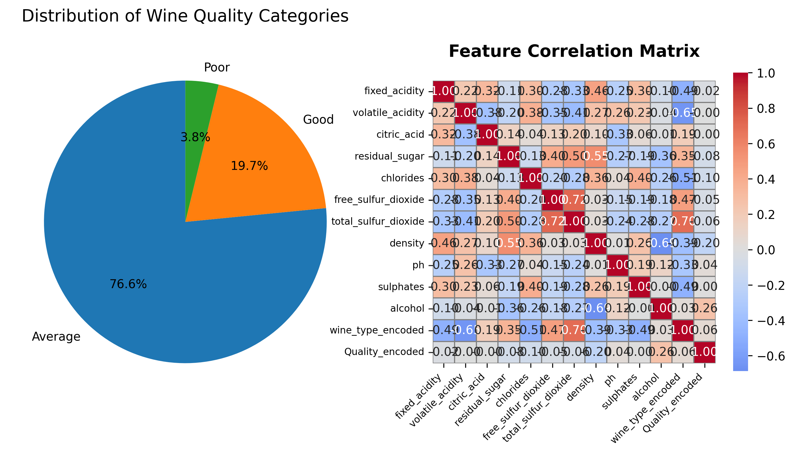

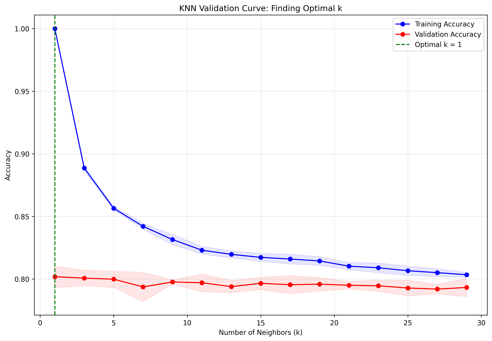

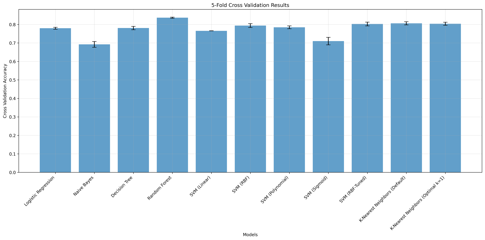

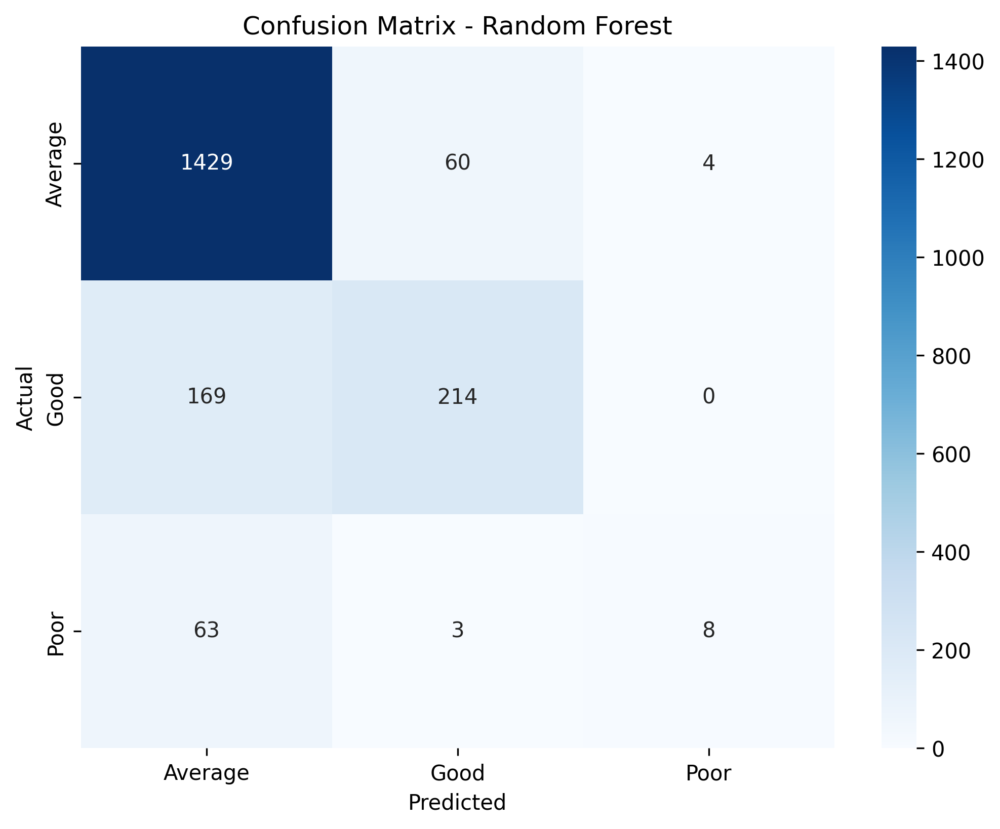

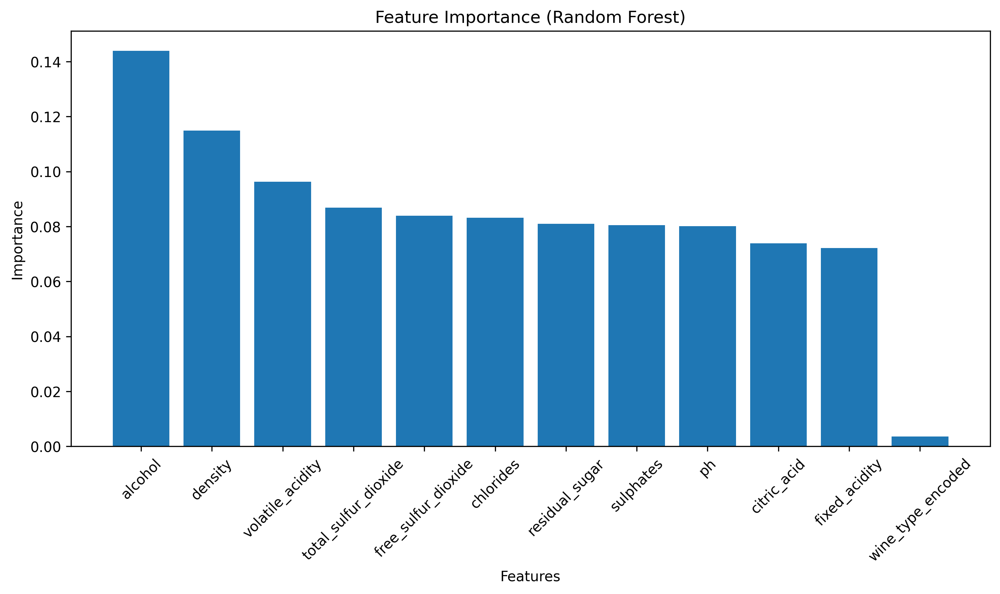

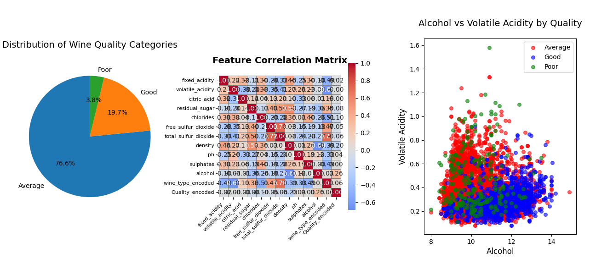

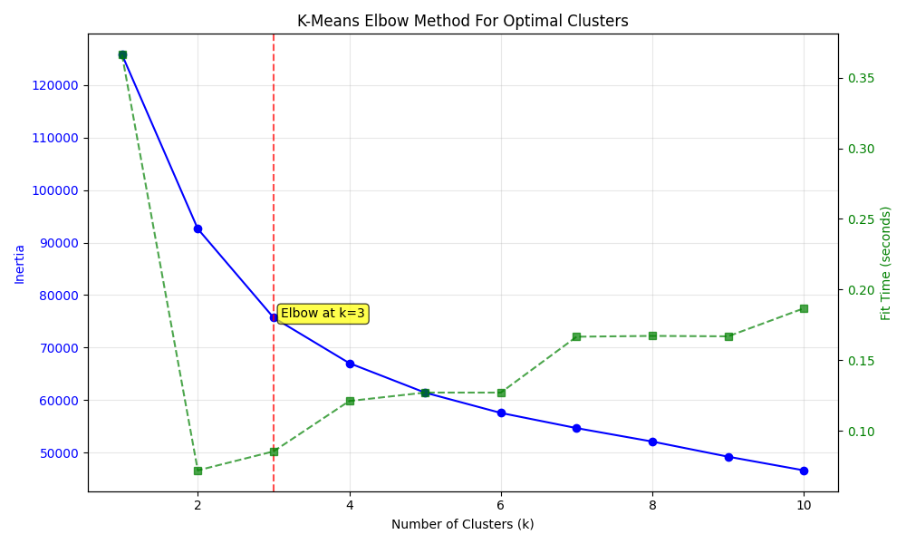

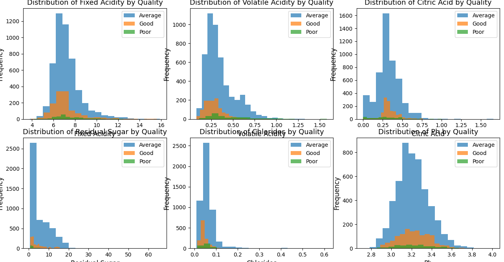
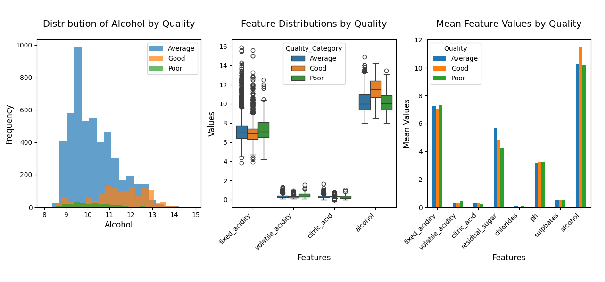
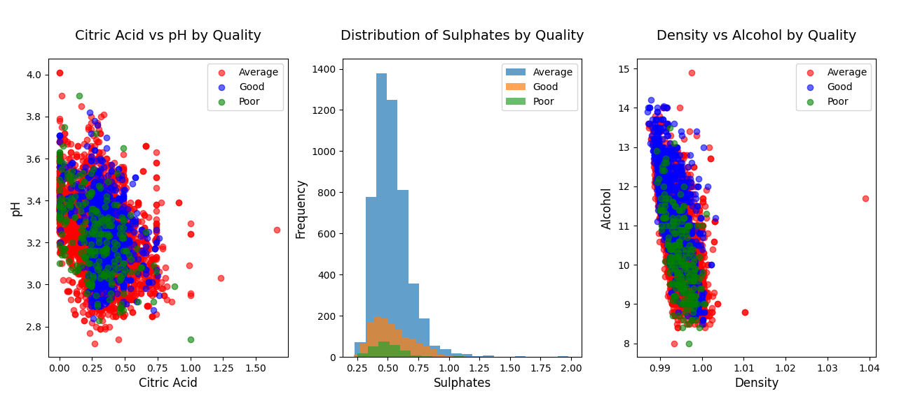
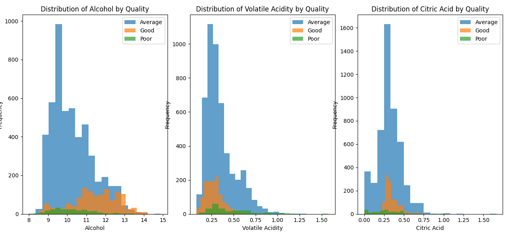
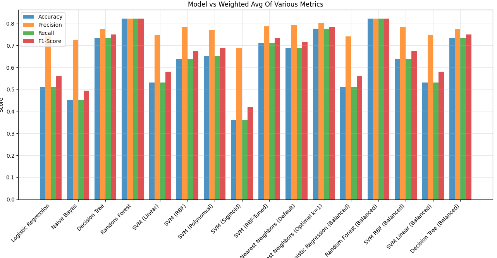


👤 Author

Apu Datta — MSBA, Baruch College (CUNY)
Live App: https://4okshqzpjpsapep79xtmbs.streamlit.app/

Last updated: Aug 2025

