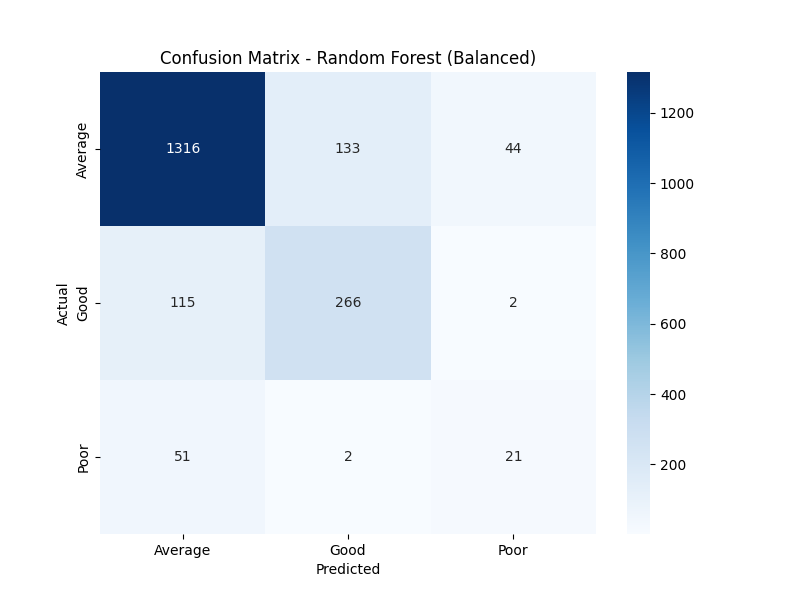

# 🍷 Wine Quality Classification - Project Overview

This project builds a classification pipeline to predict wine quality categories based on physicochemical properties.

---

## 📊 Model Evaluation & Visualizations

### 1. Validation Curve – KNN


### 2. Overall Model Metrics


### 3. K-Means Elbow Method


### 4. Feature Importance


### 5. Confusion Matrix


### 6. Correlation Heatmap


### 7. Alcohol vs Volatile Acidity


---

## 🛠️ Technologies Used

- Python (pandas, numpy, matplotlib, seaborn, scikit-learn)
- Streamlit for deployment
- Pickle for model serialization

---

## 📁 Files and Structure

```
├── wine_model.pkl
├── wine_scaler.pkl
├── wine_streamlit_app.py
├── requirements.txt
├── images/
│   ├── cv_accuracy.png
│   ├── model_metrics.png
│   ├── kmeans_elbow.png
│   ├── feature_importance.png
│   ├── confusion_matrix.png
│   ├── correlation_heatmap.png
│   ├── alcohol_vs_volatile.png
```

---

## 🚀 How to Run

1. Install dependencies:
   ```
   pip install -r requirements.txt
   ```

2. Launch the Streamlit app:
   ```
   streamlit run wine_streamlit_app.py
   ```

---

## 📬 Contact

For questions or contributions, please contact [Your Name] at [your-email@example.com].
