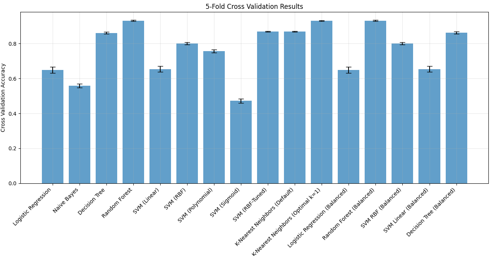

# 🍷 Wine Quality Classifier (Streamlit App)

A professional Streamlit-based machine learning app that predicts the quality of wine (Poor, Average, Good) using physicochemical properties like acidity, sugar, sulfur dioxide, alcohol, and more. Trained on the combined red and white wine dataset from Kaggle.

---

## 🚀 Key Features

- 🔮 Predicts wine quality using user inputs  
- 📊 Uses trained model (e.g., Random Forest, KNN)  
- 🎯 12+ chemical features (e.g., pH, alcohol, residual sugar)  
- 📈 Performance dashboard with CV scores  
- 📦 Modular pipeline: model, scaler, encoders, metadata  

---

## 🧠 ML Workflow

| Step              | Method / Tool                  |
|-------------------|-------------------------------|
| Data Cleaning     | Imputation, Label Encoding     |
| Models Used       | Logistic, KNN, SVM, RF, etc.   |
| Tuning            | Optimal K selection for KNN    |
| Evaluation        | Accuracy, CV, Confusion Matrix |
| Deployment        | Streamlit App                  |

---

## 📁 Folder Structure

```
📦 project/
├── wine_streamlit_app.py       # Streamlit UI
├── Wine_data_processing_model_training_testing.py
├── *.pkl                       # Trained model files
├── requirements.txt
└── README.md
```

---

## ▶️ Run Locally

```bash
pip install -r requirements.txt
streamlit run wine_streamlit_app.py
```

---

## 🌐 Deploy to Streamlit Cloud

1. Push to GitHub  
2. Go to [streamlit.io/cloud](https://streamlit.io/cloud)  
3. Set main file: `wine_streamlit_app.py`  
4. Click “Deploy” 🚀  

---

## 📚 Dataset

- 📊 Source: [Kaggle Wine Quality](https://www.kaggle.com/datasets/rajyellow46/wine-quality)  
- ✅ 6,497 combined samples (Red + White)  
- 🎯 Target: Wine Quality → Categorized into `Poor`, `Average`, `Good`  

---

## 📸 Visualizations

All visualizations are generated and saved in the `images/` folder during model training and evaluation.

| 📂 File Name                  | 🧪 Description                                           |
|------------------------------|----------------------------------------------------------|
| `target_distribution_pie.png`| Pie chart showing distribution of wine quality categories |
| `correlation_heatmap.png`    | Feature correlation heatmap to detect multicollinearity  |
| `alcohol_vs_volatile.png`    | Scatterplot of Alcohol vs. Volatile Acidity              |
| `feature_importance.png`     | Feature importance chart from Random Forest model        |
| `confusion_matrix.png`       | Confusion matrix for final model predictions             |
| `cv_results.png`             | Cross-validation score comparison across models          |
| `knn_validation_curve.png`   | Accuracy vs. K values for KNN classifier                 |
| `kmeans_elbow.png`           | Elbow method for finding optimal K in KMeans clustering  |


## 🔍 Preview – Visual Insights

| Target Distribution | Correlation Heatmap | Alcohol vs Volatile Acidity |
|---------------------|---------------------|------------------------------|
|  |  |  |

| Feature Importance | Confusion Matrix | CV Results |
|--------------------|------------------|------------|
|  |  |  |

| KNN Validation Curve | KMeans Elbow |
|----------------------|--------------|
|  |  |


---


## 👨‍💻 Student 

**Apu Datta**  
MSBA, Baruch College (CUNY)  
[GitHub Repository](https://github.com/dattaBus-anls/-Professional-Wine-Quality-Classifier-.git)

---

## 📄 License

Open for educational & academic use.
